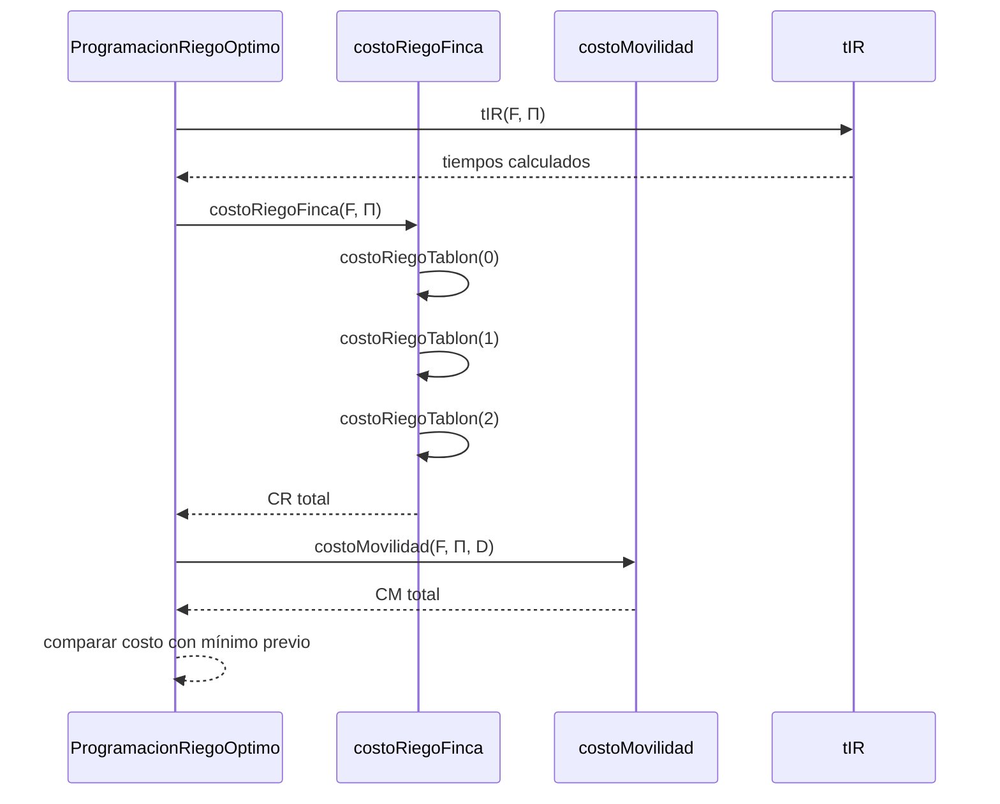
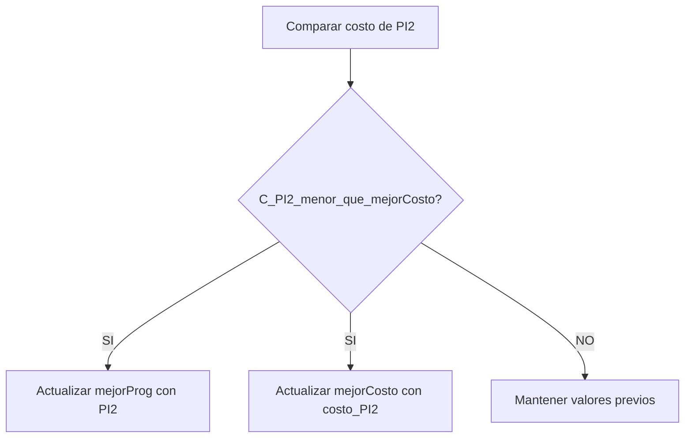
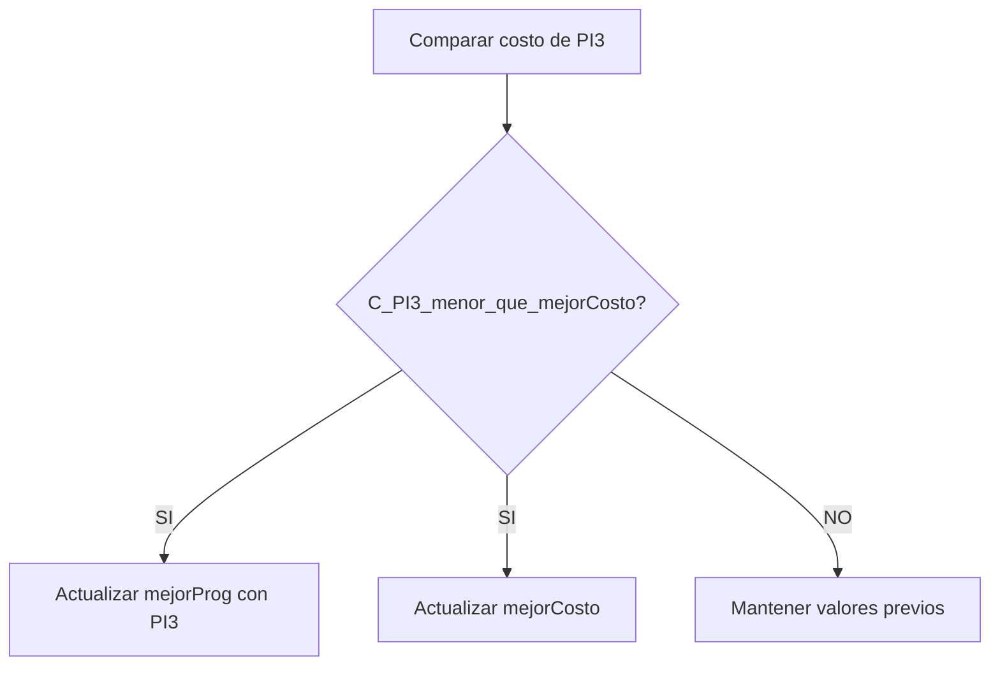
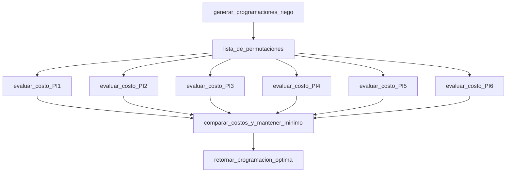

# INFORME DE PROCESO

La función ProgramacionRiegoOptimo es recursiva indirectamente porque:

- Recorre la lista de permutaciones generada en 2.5.

- Para cada permutación invoca funciones recursivas (costoRiego, tIR, etc.)


A continuación, se muestra el proceso interno, usando un ejemplo reducido con 3 tablones.

Sea la finca F con 3 tablones.
Permutaciones generadas:
$$
Π_1 = \langle 0,1,2 \rangle \\
Π_2 = \langle 0,2,1 \rangle \\
Π_3 = \langle 1,0,2 \rangle \\
Π_4 = \langle 1,2,0 \rangle \\
Π_5 = \langle 2,0,1 \rangle \\
Π_6 = \langle 2,1,0 \rangle
$$

La función evalúa cada una recursivamente.


---

## 1. Pila de llamadas para evaluar los costos de una permutación

Ejemplo con Π = ⟨0,1,2⟩:



---

## 2. Proceso recursivo de selección del mínimo

Para simplificar, asumamos que la función usa un foldLeft.

Estado inicial:
```scala
mejorProg = Π1
mejorCosto = C(Π1)
índice = 2
``` 
Iteración 2 (Π₂)

Iteración 3 (Π₃)

Se repite el mismo proceso, formando una recursión por acumulación.

---

## 3. Diagrama final del proceso completo

