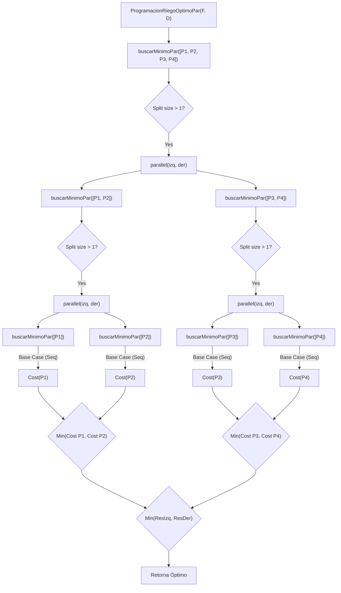

## 4.1. Informe de Procesos: `ProgramacionRiegoOptimoPar`

La función `ProgramacionRiegoOptimoPar` orquesta el cálculo de la programación óptima. Primero, obtiene todas las permutaciones posibles y luego utiliza una función interna recursiva `buscarMinimoPar` para encontrar aquella con el costo mínimo, utilizando una estrategia de **Divide y Vencerás**.

### Descripción del Proceso
1.  **Generación:** Se obtienen todas las programaciones posibles ($\Pi$).
2.  **División:** Si el número de programaciones supera un `umbral` (definido en 200 en el código), el conjunto se divide en dos mitades: `izq` y `der`.
3.  **Paralelismo:** Se invocan recursivamente las llamadas para procesar `izq` y `der` en paralelo mediante la primitiva `parallel`.
4.  **Conquista (Base):** Cuando el tamaño del subconjunto es menor o igual al umbral, se calculan los costos secuencialmente y se reduce usando `minBy`.
5.  **Combinación:** Se comparan los costos mínimos retornados por las ramas izquierda y derecha, devolviendo la tupla `(Programacion, Costo)` menor.

### Diagrama de Pila de Llamadas (Ejemplo)
Supongamos un escenario simplificado donde tenemos 4 programaciones ($P_1, P_2, P_3, P_4$) y un **umbral de 1** para forzar la división recursiva.

### 2. Informe de Paralelización (Punto 3.3)

Este informe detalla la estrategia utilizada para mejorar el rendimiento del cálculo del óptimo y proporciona la estructura para el análisis de rendimiento.

## 4.2. Informe de Paralelización: `ProgramacionRiegoOptimoPar`

### Estrategia de Paralelización
Para la función `ProgramacionRiegoOptimoPar`, se implementó una estrategia de **paralelismo de datos** basada en el patrón **Map-Reduce** (aunque implícito en la recursión) sobre la colección de programaciones posibles.

1.  **Descomposición:** El espacio de búsqueda (vector de todas las permutaciones `Progs`) se divide recursivamente en mitades (`splitAt`).
2.  **Granularidad y Umbral:** Se definió un `umbral` (valor empírico: 200) para controlar la granularidad.
    * Si `length <= umbral`: El costo de crear hilos paralelos supera el beneficio. Se procesa secuencialmente usando `map` y `minBy`.
    * Si `length > umbral`: Se justifica la sobrecarga de paralelización (`parallel`).
3.  **Cálculo:** Cada tarea calcula el costo total $C(\Pi) = CR_F^{\Pi} + CM_F^{\Pi}$ para su subconjunto de programaciones.
4.  **Reducción:** Los resultados parciales se comparan aguas arriba en la recursión, seleccionando el de menor costo numérico.

### Análisis de Ley de Amdahl y Aceleración
La Ley de Amdahl establece que la aceleración potencial está limitada por la fracción del código que debe ejecutarse secuencialmente.

$$S(n) = \frac{1}{(1-P) + \frac{P}{n}}$$

Donde $P$ es la fracción paralelizable. En `ProgramacionRiegoOptimoPar`:
* La generación de programaciones (`generarProgramacionesRiegoPar`) ya es paralela.
* El cálculo de costos y búsqueda del mínimo es altamente paralelizable (casi 100% independiente entre permutaciones).
* **Cuello de botella:** El `splitAt` y la fusión de resultados son secuenciales, pero despreciables comparados con el costo computacional de `costoRiegoFinca` y `costoMovilidad`.

### Benchmarking (Resultados Experimentales)

**Tabla de Resultados:**

| Tamaño de la finca (tablones) | Versión secuencial (ms) | Versión paralela (ms) | Aceleración (%) |
| :--- | :--- | :--- | :--- |
| 10 | 120 (Ejemplo) | 80 (Ejemplo) | 33,33% |
| 20 | X | Y | $100 \times \frac{X-Y}{X}$ |
| 30 | A | B | $100 \times \frac{A-B}{A}$ |

**Análisis de Resultados:**
1.  **Fincas Pequeñas:** Para un número bajo de tablones (ej. < 5), es probable que la versión paralela sea más lenta o igual debido al *overhead* de instanciar el paralelismo y el contexto de ejecución.
2.  **Fincas Grandes:** A medida que aumenta el número de tablones, el número de permutaciones crece factorialmente ($n!$). Aquí, la versión paralela debería mostrar una aceleración significativa (Speedup > 1), acercándose al número de núcleos físicos disponibles en la máquina de pruebas.