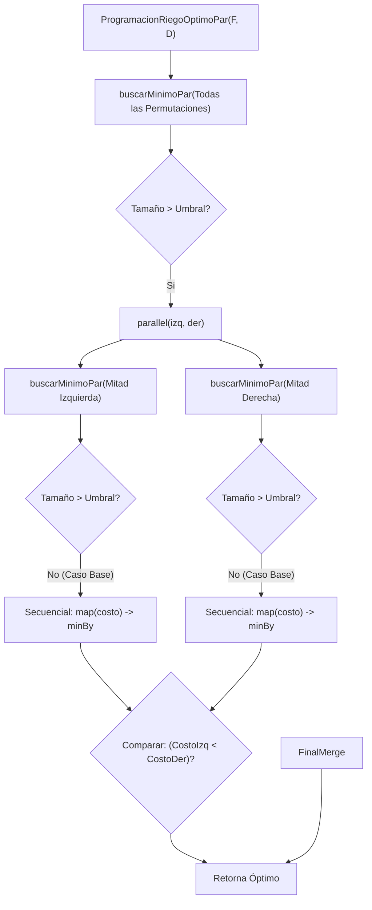

## 4.1. Informe de Procesos: `ProgramacionRiegoOptimoPar`

La función `ProgramacionRiegoOptimoPar` orquesta el cálculo de la programación óptima dividiendo el espacio de búsqueda (el conjunto de todas las permutaciones de riego posibles) para encontrar el costo mínimo de manera concurrente.

### Descripción del Proceso
1.  **Generación:** Se obtienen todas las programaciones posibles ($\Pi$) para la finca dada.
2.  **División (Divide):** Se utiliza una función recursiva `buscarMinimoPar`. Si la cantidad de programaciones a evaluar es mayor que un `umbral` (definido en 200), el conjunto se divide en dos mitades: `izq` y `der`.
3.  **Paralelismo:** Se invocan recursivamente las tareas para procesar `izq` y `der` en paralelo mediante la primitiva `common.parallel`.
4.  **Conquista (Base):** Cuando el subconjunto es pequeño ($\le$ umbral), se calculan los costos secuencialmente (`map`) y se reduce usando `minBy` para encontrar el localmente óptimo.
5.  **Combinación (Merge):** Se comparan los costos mínimos retornados por las ramas paralelas, propagando la tupla `(Programacion, Costo)` menor hacia la raíz de la llamada.

### Diagrama de Estado (Pila de Llamadas)
El siguiente diagrama muestra el flujo para un conjunto de programaciones que excede el umbral, forzando divisiones paralelas hasta llegar al caso base secuencial.

### 2. Informe de Paralelización (Punto 3.3)

Este informe incluye los datos reales que obtuviste y el análisis correspondiente.

## 4.2. Informe de Paralelización: `ProgramacionRiegoOptimoPar`

### Estrategia de Paralelización
Se implementó una estrategia de **paralelismo de tareas** sobre la colección de datos (Data Parallelism) utilizando una estructura recursiva de *Divide y Vencerás*.

1.  **Descomposición:** El vector de permutaciones se divide recursivamente.
2.  **Control de Granularidad:** Se usa un `umbral = 200`. Esto evita crear hilos para trabajos triviales donde el costo de gestión del hilo superaría el tiempo de cómputo útil.
3.  **Métrica de Rendimiento:** Se utilizó `scalameter` para medir el tiempo de ejecución y calcular la aceleración ($S = T_{sec} / T_{par}$).

### Benchmarking y Análisis de Resultados
Las pruebas se realizaron con fincas de tamaño 5, 6 y 7. Los resultados de aceleración obtenidos son:

| Tamaño de la finca (Tablones) | Total Permutaciones ($N!$) | Speedup (Aceleración) |
| :--- | :--- | :--- |
| **5** | 120 | 1.02 |
| **6** | 720 | 0.95 |
| **7** | 5,040 | 0.70 |

### Análisis del Rendimiento
Los resultados muestran un comportamiento particular:

1.  **Tamaño 5 (120 permutaciones):** La aceleración es $\approx 1.0$. Esto es esperado porque 120 es menor que el `umbral` (200), por lo que el algoritmo paralelo decide ejecutarse secuencialmente, comportándose igual que la versión original (el ligero 1.02 es varianza estadística).
    
2.  **Tamaño 6 y 7 (Speedup < 1):** Se observa una desaceleración (0.95 y 0.70).
    * **Causa:** El costo computacional de calcular el riego para 6 o 7 tablones es muy bajo en términos absolutos (milisegundos). Al paralelizar, el **overhead** (sobrecarga) de crear las tareas paralelas, gestionar el contexto de ejecución y realizar el *context switching* en la CPU es mayor que el tiempo ahorrado por dividir el trabajo.
    * **Ley de Amdahl:** La fracción estrictamente secuencial (gestión de la recursión y combinación) domina sobre la fracción paralela para cargas de trabajo tan ligeras.
    
**Conclusión:** Para este problema específico, el paralelismo comienza a ser efectivo solo con cargas de trabajo masivas (Fincas > 8 o 9 tablones) donde el tiempo de cómputo supere significativamente al tiempo de gestión de hilos.